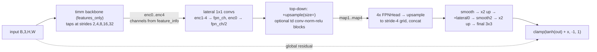
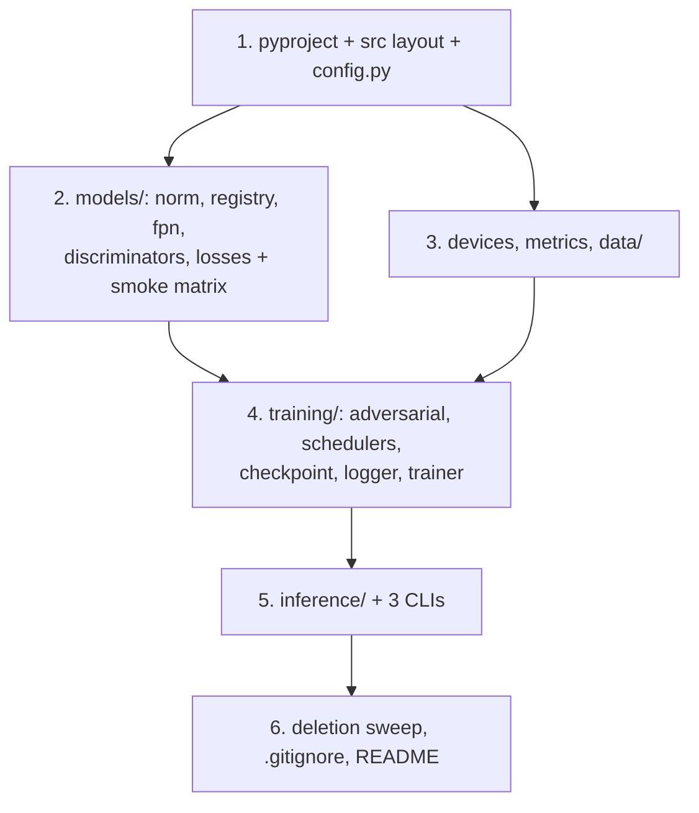

# DeblurGAN-v2 Refactor: Backbone-Agnostic (timm) + Full Modernization

## Context

The DeblurGAN-v2 paper (arXiv:1908.03826) presents its FPN generator as backbone-agnostic, but this implementation hardcodes each backbone in a separate copy-pasted file (`models/fpn_mobilenet.py`, `fpn_inception.py`, `fpn_inception_simple.py`, `fpn_densenet.py`) with hand-written lateral-conv channel counts, vendored backbone code (`mobilenet_v2.py`, `senet.py`), and per-file quirks: inception reflection-pad hacks (`fpn_inception.py:165-167`), densenet missing **both** the global residual and the output clamp (`fpn_densenet.py:65` returns bare `tanh(final)`), and mobilenet loading `mobilenetv2.pth.tar` from a hardcoded local path (`fpn_mobilenet.py:86`). The rest of the repo is a decayed fork: hardcoded `.cuda()`, no training resume, deprecated APIs (`Variable`, `_LRScheduler`, `F.upsample`), an `eval()`-based GAN factory (`adversarial_trainer.py:21`), broken tests, hijacked entry points with Windows paths (`predict.py:136-142`), and an untyped config dict threaded by string keys.

**Goal:** one generic FPN generator over any timm backbone (channels auto-inferred), plus a properly organized, tested, device-agnostic package.

**User decisions (settled — do not revisit):** clean break from old checkpoints (delete legacy model files, no key-remapping); YAML → typed dataclasses (no Hydra); full modernization (src layout, device abstraction, resume, fixed tests, unified CLI).

All four legacy FPN variants share identical topology (verified: `fpn_mobilenet.py:52-69` vs `fpn_inception.py:68-81` vs `fpn_inception_simple.py:69-82` vs `fpn_densenet.py:54-65`); only backbone taps/channels differ, plus two structural toggles: inception/mobilenet have `td` conv+norm+relu blocks in the top-down path, "simple"/dense use plain addition.

## Target layout

```
DeblurGANv2/
├── pyproject.toml                 # replaces requirements.txt; console scripts
├── configs/gopro.yaml             # new-schema example config (relative paths)
├── src/deblurgan/
│   ├── __init__.py                # __version__, re-export Config, Predictor
│   ├── config.py                  # dataclasses + from_dict + load_config + validation
│   ├── devices.py                 # resolve_device("auto"|"cpu"|"cuda[:N]"|"mps")
│   ├── metrics.py                 # psnr/ssim via skimage.metrics (uint8 RGB, channel_axis=-1)
│   ├── data/
│   │   ├── dataset.py             # PairedDataset (RGB-fixed), build_dataloader
│   │   └── aug.py                 # albumentations>=1.4 transforms + corrupt registry
│   ├── models/
│   │   ├── __init__.py            # build_generator/build_discriminator/build_losses
│   │   ├── norm.py                # get_norm_layer
│   │   ├── fpn.py                 # FPNHead, TimmFPN, FPNGenerator  ← the core deliverable
│   │   ├── discriminators.py      # NLayerDiscriminator, DoubleScaleDiscriminator
│   │   ├── losses.py              # PerceptualLoss, ContentLoss, adv losses (device-agnostic)
│   │   └── registry.py            # small Registry class; no if-chains, no eval()
│   ├── training/
│   │   ├── trainer.py             # Trainer (fit/_train_epoch/_validate/resume)
│   │   ├── adversarial.py         # NoGAN/SingleGAN/DoubleGAN adapters
│   │   ├── schedulers.py          # build_scheduler via stdlib LambdaLR/Cosine/Plateau
│   │   ├── checkpoint.py          # save/load with optimizer+epoch+config embedded
│   │   └── logger.py              # MetricLogger (torch.utils.tensorboard)
│   ├── inference/
│   │   ├── predictor.py           # Predictor (builds model from ckpt-embedded config)
│   │   └── video.py               # process_video
│   └── cli/
│       ├── train.py               # deblurgan-train --config ... -o key=value
│       ├── predict.py             # deblurgan-predict CKPT INPUTS --output ...
│       └── evaluate.py            # deblurgan-eval CKPT --data gopro/test
└── tests/                         # pytest: config, dataset, aug, models, losses, trainer, predictor
```

## 1. Generic FPN generator (`models/fpn.py`)



- **`_create_backbone(name, pretrained)`**: `timm.create_model(name, features_only=True, pretrained=...)`; read `feature_info.reduction()`/`.channels()`; map required strides `(2,4,8,16,32)` to tap indices; **validate-and-reject** backbones lacking any of the 5 strides (ViT/Swin) with an actionable error listing available reductions.
- **`TimmFPN`**: lateral 1×1 convs with channels **auto-inferred** from `feature_info` (replaces hardcoded `Conv2d(160/64/32/24/16, ...)` at `fpn_mobilenet.py:106-110`); top-down pathway with optional `td` conv+norm+relu blocks (`td_blocks: bool` config); `freeze()`/`unfreeze()` toggling backbone `requires_grad` (frozen at init, matching `fpn_mobilenet.py:112-117` warmup behavior).
- **`FPNGenerator`**: 4× `FPNHead` → upsample to stride-4 grid → concat → `smooth` → ×2 up → `+ lateral0` → `smooth2` → ×2 up → final 3×3 conv → `clamp(tanh(out) + x, -1, 1)` (paper's global residual — also fixes densenet variant which returned bare `tanh`).
- **Size-targeted interpolation everywhere** (`F.interpolate(..., size=ref.shape[-2:])` instead of `scale_factor=2` / deprecated `F.upsample`) — deletes the inception reflection-pad hacks and makes any backbone's rounding safe. Contract stays: callers pad input to multiple of 32 (Predictor does).
- Norm: `get_norm_layer('instance'|'batch')` with **`InstanceNorm2d(affine=True, track_running_stats=False)`** (replaces `affine=False, track_running_stats=True` at `networks.py:21`) — makes `.eval()` inference correct and kills predict.py's `model.train(True)` hack (`predict.py:23-25`).
- Defaults per paper: `fpn_channels=256`, `head_channels=128`, instance norm, pretrained backbone.

Smoke matrix during implementation: `mobilenetv2_100`, `inception_resnet_v2`, `densenet121`, `resnet50`, `efficientnet_b0` forward at 256×256 and a non-square multiple-of-32 size; assert output shape == input, range [-1,1]; assert swin/vit raises.

## 2. Discriminators & losses

- Keep `NLayerDiscriminator` (PatchGAN, math unchanged from `networks.py:217-261`; drop dead `use_parallel/use_sigmoid` args).
- **`DoubleScaleDiscriminator(nn.Module)`** with `.patch` (n_layers from config) + `.full` (n_layers=5) submodules — replaces the `{'patch':…, 'full':…}` dict contract (`networks.py:311-312`); one `.to(device)`, one `.parameters()`, one `state_dict()`. This is the pinned contract for `build_discriminator(cfg)` → `nn.Module | None`.
- Delete `ResnetGenerator`, `MultiScaleDiscriminator`, `DicsriminatorTail` (not in paper, not default).
- `losses.py` rewritten device-agnostic (no `.cuda()`, no `Variable`; buffers for VGG normalization). Latent bugs fixed by the rewrite:
  - `PerceptualLoss`: VGG19 conv3_3, `0.006*MSE(feat) + 0.5*MSE(pixel)` — fixes ImageNet normalization applied **in-place to batch element 0 only** (`models/losses.py:50-51`).
  - `DiscLossLS.get_g_loss` calls `DiscLoss.get_g_loss(self, net, fakeB)` with a missing arg (`losses.py:227`) — lsgan G-loss crashes today.
  - `GANLoss.get_target_tensor` caches label tensors by `numel` with hardcoded `.cuda()` (`losses.py:76-91`) — gone; targets built per-call on `input.device`.
  - `wgan-gp` gradient penalty: per-sample `alpha` (`torch.rand(B,1,1,1, device=real.device)` instead of one scalar for the whole batch, `losses.py:247-249`).
  - Adversarial: `gan`, `lsgan`, `wgan-gp`, `ragan`, `ragan-ls` (paper default) behind a common `AdversarialLoss` interface (`loss_d(net_d, fake, real)` / `loss_g(...)`). Minimal `ImagePool` reimplemented inside `losses.py` for the ragan pools (`util/` deleted).
- `registry.py`: tiny `Registry` class for generators/discriminators/losses; `create()` errors list available names. Replaces string-if-chains and the `eval()` dispatch in `adversarial_trainer.py:21`.
- **No `nn.DataParallel` anywhere** (multi-GPU explicitly out of scope; also removes the `.module` coupling at `train.py:38`).

## 3. Typed config (`config.py`)

Dataclass hierarchy: `Config{experiment, data: DataConfig{train/val: SplitConfig, batch_size, num_workers}, generator: GeneratorConfig{backbone, fpn_channels, head_channels, td_blocks, norm, pretrained}, discriminator{kind, num_layers}, losses{content, adversarial, adv_lambda}, optimizer{name, lr=1e-4, betas}, scheduler{name, start_epoch, min_lr, ...}, training{epochs, warmup_epochs, batches_per_epoch, device, amp, seed, resume, output_dir}}`.

- `SplitConfig` takes **separate `blur_glob` / `sharp_glob`** (kills the `files_a == files_b` identity trap in `config/config.yaml:8-9`, where the model currently trains to reconstruct its input); val defaults to `scope: none`, empty `corrupt`.
- One recursive `from_dict` helper (~60 lines, `typing.get_type_hints` + `Literal` checks): unknown key → error with YAML path; missing required → error. No pydantic/dacite.
- `load_config(path, overrides)` supports repeatable CLI `-o training.epochs=5` dotted overrides.
- Semantic validation: `warmup_epochs < epochs`, `scheduler.start_epoch < epochs`, even `fpn_channels`, known corrupt names.
- New `configs/gopro.yaml` with relative paths, `lr: 0.0001` (fixes the `0.01` footgun at `config.yaml:69`), `disc_loss: ragan-ls` (matches paper/README, not the config's stale `wgan-gp`).

## 4. Trainer (`training/trainer.py`) — bugs fixed by design

- **Device abstraction**: `resolve_device()` (auto → cuda/mps/cpu); everything `.to(device)`; CPU training works (needed for tests).
- **Warmup/unfreeze** (`train.py:37-40`): `netG.unfreeze()` directly (no `.module`), rebuild optimizer_G over trainable params, rebuild scheduler with `last_epoch=epoch-1` to keep schedule position. Resume path replays unfreeze before loading optimizer state.
- **Exact epoch length** via `itertools.islice(loader, n_batches)` — fixes off-by-one `i > epoch_size` (`train.py:83,107`).
- **D-step on `fake.detach()`** → no `retain_graph=True` (`train.py:117`); correct RaGAN-LS on detached fake; G-step re-runs D forward on attached fake. **`adv_lambda` applies only to G's adversarial term** (old code also scaled D's loss, `train.py:116` — behavior change, noted in README).
- Scheduler factory fixes: dead `sgdr` branch keyed on *optimizer* name (`train.py:139`) deleted along with `WarmRestart`; `linear` via `LambdaLR` with correct denominator (`schedulers.py:58` divides by `num_epochs` instead of `num_epochs - start_epoch`, so lr never reaches `min_lr`); `cosine` via stdlib `CosineAnnealingLR`; `plateau` → `mode='max'` stepped with val PSNR (fixes min/max mismatch: `train.py:134-136` uses `mode='min'` but never passes a metric). Drop `schedulers.py`'s private `_LRScheduler` subclasses.
- `no_gan` → no optimizer_D/scheduler_D at all (replaces the dummy-parameter hack, `adversarial_trainer.py:53`).
- Optional AMP (cuda only, default off).
- **Checkpoints** (`training/checkpoint.py`): `{version, epoch, best_psnr, generator, generator_config, adversarial, optimizer_G/D, scheduler_G/D, config_yaml}` saved as `runs/{experiment}/last.pt` + `best.pt`. Config stored as YAML string → `torch.load(weights_only=True)` compatible. Full resume support. Clear error when someone loads an old `.h5`.
- `training/logger.py`: `torch.utils.tensorboard` (drop tensorboardX); no `logging.basicConfig` side effect in constructor (`metric_counter.py:13`); logs under `runs/{experiment}/`; best-model decision moves into Trainer.

## 5. Data pipeline

- `data/dataset.py`: `PairedDataset` returns `{"blur", "sharp"}` float32 CHW in [-1,1]; **RGB everywhere** — today training feeds BGR (`dataset.py:43-48`, `_read_img` keeps cv2's BGR and even flips the skimage fallback *to* BGR) while inference feeds RGB (`predict.py:111`), so train/predict channel order disagree; pairing validation (equal counts, matching sorted basenames → error on glob mistakes); **drop the SHA1-hash bucket split** (`bounds`, `dataset.py:19-40`) — explicit train/val globs instead; preload via `ThreadPoolExecutor` (drops joblib).
- `build_dataloader`: restores `num_workers` (fixes commented-out block, `train.py:178-184`), `pin_memory` on cuda, `persistent_workers`, `cv2.setNumThreads(0)` in `worker_init_fn`.
- `data/aug.py`: scopes `none|weak|geometric` (**drop nonexistent 'strong'** — fixes KeyErrors in `test_aug.py:15`, `test_dataset.py:40`); corrupt-name registry adapting albumentations ≥1.4 API (`Cutout`→`CoarseDropout`, `ImageCompression` kwargs, no `always_apply`) in one place.
- `metrics.py`: `skimage.metrics` PSNR/SSIM with `channel_axis=-1` (the old `multichannel=True` at `models/models.py:28` is removed in skimage ≥0.19).

## 6. Inference & eval

- `Predictor(checkpoint, device="auto")`: builds generator from **config embedded in the checkpoint** (no YAML needed at inference — replaces `predict.py:18-20` reading `config/config.yaml`); uint8 RGB in/out; pad-to-32 only when needed (fixes always-pad off-by-one, `predict.py:43-44`); `.eval()` + `no_grad` (train-mode hack removed per §1 norm contract); mask support deleted (vestigial).
- `cli/predict.py`: file/dir/glob inputs, `--output`, `--video` (via `inference/video.py`, ported from `predict.py:71-89`). Replaces the hijacked `__main__` with its hardcoded Windows batch loop (`predict.py:122-142`).
- `cli/evaluate.py`: GoPro-layout eval with `deblurgan.metrics` — replaces `test_metrics.py` (external `ssim` package, `Variable`, loader-less `yaml.load` all gone). `util/metrics.py` + `util/image_pool.py` deleted.

## 7. pyproject.toml

- Deps: `torch>=2.2`, `torchvision>=0.17` (VGG for perceptual loss), `timm>=1.0`, `albumentations>=1.4,<3`, `opencv-python-headless`, `numpy`, `PyYAML`, `tqdm`, `scikit-image>=0.22`, `tensorboard`. Dev: `pytest`, `ruff`.
- **Dropped**: `fire` (→ argparse), `pretrainedmodels`, `torchsummary`, `glog`, `joblib`, `tensorboardX`, external `ssim`.
- Console scripts: `deblurgan-train`, `deblurgan-predict`, `deblurgan-eval`.

## 8. Deletions (clean break)

`models/fpn_mobilenet.py`, `fpn_inception.py`, `fpn_inception_simple.py`, `fpn_densenet.py`, `unet_seresnext.py`, `mobilenet_v2.py`, `senet.py`, `networks.py`, `models.py` (its `get_input`/`tensor2im`/metrics logic → trainer utils) · `adversarial_trainer.py`, `schedulers.py`, `metric_counter.py`, `util/` · `picture_to_video.py`, `test.py`, `test.sh`, `test_batchsize.py`, `test_metrics.py` · `config/config.yaml`, `requirements.txt` · old `train.py`/`predict.py`/`dataset.py`/`aug.py`/`test_aug.py`/`test_dataset.py` (rewritten into the package). README rewritten (install, CLI usage, timm backbone examples, clean-break notice: old `.h5` weights incompatible, retraining required).

## 9. Tests (pytest)

- `conftest.py`: tmp paired-image fixture; tiny config (backbone `mobilenetv3_small_050`, `pretrained: false` for offline CI, size 64, cpu).
- `test_config.py`: roundtrip, unknown-key error with path, Literal violations, overrides, semantic checks.
- `test_models.py`: parametrized tiny backbones → forward shape/range; stride-4-first backbone raises.
- `test_dataset.py` / `test_aug.py`: pairing, RGB order, all real scopes/crops, corrupt registry builds every name.
- `test_losses.py`: each loss finite; grads flow to G on `loss_g`, to D only on `loss_d(fake.detach(), real)`.
- `test_trainer.py`: 2-batch CPU end-to-end; unfreeze at warmup boundary re-enables grads + rebuilds optimizer; checkpoint save→resume roundtrip.
- `test_predictor.py`: non-multiple-of-32 image in → same-shape uint8 out.

## Implementation order



1. Skeleton: `pyproject.toml`, src layout, `config.py` + tests (everything depends on the types).
2. `models/` package: norm, registry, fpn, discriminators, losses + backbone smoke matrix + tests.
3. `devices.py`, `metrics.py`, `data/` + tests.
4. `training/` (adversarial, schedulers, checkpoint, logger, trainer) + smoke/resume tests.
5. `inference/` + three CLIs + tests.
6. Deletion sweep, `.gitignore` (`runs/`, `*.pt`), README rewrite.

## Verification

- `pip install -e .[dev]` in a fresh venv; `pytest` fully green on CPU with no network (pretrained=false in tests).
- Backbone-agnosticism proof: `deblurgan-train --config configs/gopro.yaml -o generator.backbone=resnet50 -o training.epochs=1 -o training.batches_per_epoch=5 -o data.batch_size=1` on a tiny local dataset (generate synthetic blur/sharp pairs into scratchpad) for 3 different backbones — losses finite, checkpoints written.
- Resume: kill after epoch 1, rerun with `-o training.resume=runs/<exp>/last.pt`, confirm epoch counter/optimizer state continue.
- `deblurgan-predict runs/<exp>/best.pt some_image.png --output out/` produces a same-size image; `deblurgan-eval` prints PSNR/SSIM on the tiny val set.

## Noted behavior changes (README changelog)

Old `.h5` checkpoints unusable; D loss no longer scaled by `adv_lambda`; perceptual-loss normalization bugfix changes numerics; training data now RGB (was BGR); default lr 1e-4; val no longer corrupted by default; instance norm `affine=True, track_running_stats=False` (eval-mode inference); densenet-style configs now get the global residual + clamp like every other backbone.

## Open risks

- timm `feature_info` conventions for exotic families (some report 6 levels / stride-1 level) — index-lookup by reduction handles it; covered by smoke matrix.
- Albumentations kwarg drift across 1.4/2.x — isolated in the corrupt registry + tested.
- Frozen-backbone BatchNorm running stats still update during warmup (parity with original kept; `freeze()` could also `.eval()` the backbone — deferred).
- GAN training with the fixed D-loss scaling may need `adv_lambda`/lr retuning to reproduce paper-level results.